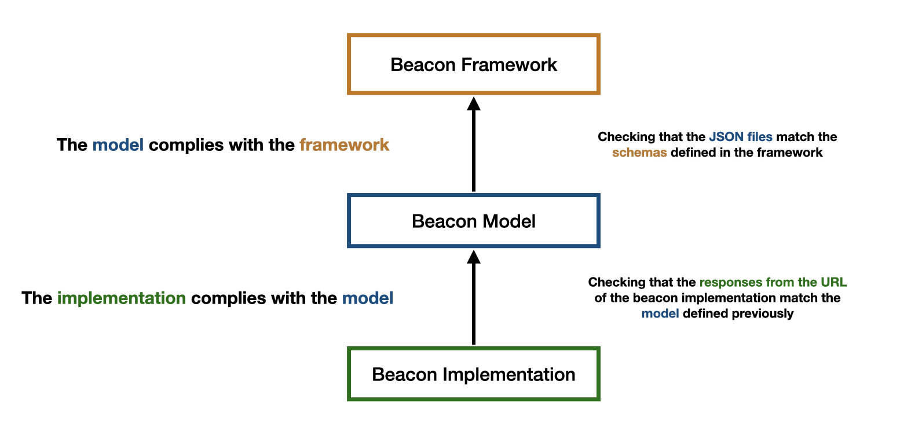

# Beacon verifier



## Installation

> Requirements: [Rust](https://www.rust-lang.org/tools/install)

```sh
cargo install beacon-verifier
```

## Usage

You can specify one or multiple urls:

```sh
beacon-verifier https://beacon-url.com/
```

> By default, the [Beacon 2 specification](https://github.com/ga4gh-beacon/beacon-v2-Models/tree/main/BEACON-V2-draft4-Model) is being used. But you can provide your own spec with the `--spec` option. The spec should follow the [Beacon Framework](https://github.com/ga4gh-beacon/beacon-framework-v2).

```sh
beacon-verifier --spec https://beacon-spec.com/ https://beacon-url.com/
```

Alternatively, you can specify a local specification:

```sh
beacon-verifier --spec file://$PWD/tests/BEACON-V2-draft4-Model https://beacon-url.com/
```

## Output

The output is a JSON file written to stdout. You can redirect it to save it into a file.

```sh
beacon-verifier https://beacon-url.com/ > /path/to/output
```

### Output example

```json
[
    {
        "name": "Beacon Name",
        "url": "https://...",
        "entities": {
            "individuals": {
                "name": "Individuals",
                "url": "https://.../individuals",
                "valid": true
            },
            "variants": {
                "name": "Variants",
                "url": "https://.../variants",
                "valid": false
            },
            "biosamples": {
                "name": "Biosamples",
                "url": "https://.../biosamples",
                "valid": null
            }
        }
    }
]
```

### Output format

The output is a `Vec<Beacon>` with the following format:

```rust
struct Beacon {
    name: String,
    url: String,
    entities: Vec<Entity>
}

struct Entity {
    name: String,
    url: String,
    valid: Option<bool>
}
```
